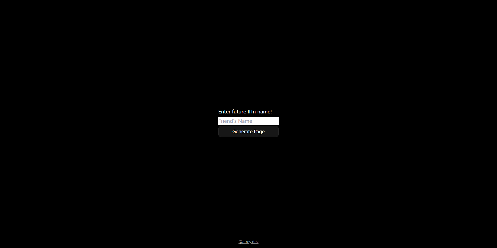

# JEE Exam Wish Message Generator

This is a simple HTML page that allows you to generate a **personalized** message to wish your friends for their JEE exam. The page is designed to be dark themed and includes a form to enter your friend's name, a set of share buttons, and a preview section to view the generated message.

## Features

- Personalized message generator
- Dark theme
- Share buttons for Telegram, WhatsApp, and copy link
- Preview section to view the generated message

## Usage

1. Clone this repository to your local machine.
2. Run `npm install` to install the dependencies.
3. Open the `index.html` file in your web browser.
4. `atb.html` file is generated page which shows the wish message.
5. Without any parameter in URL, it will redirect you to homepage.
6. Run `npx tailwindcss -i ./src/input.css -o ./src/output.css --watch` to start the Tailwind CSS watcher.

## Built With

- HTML
- CSS
- TailWind
- JavaScript

## Author

Anshuman Atrey - [@atrey.dev](https://www.instagram.com/atrey.dev/)

## License

This project is licensed under the MIT License - see the [LICENSE.md](LICENSE.md) file for details.
